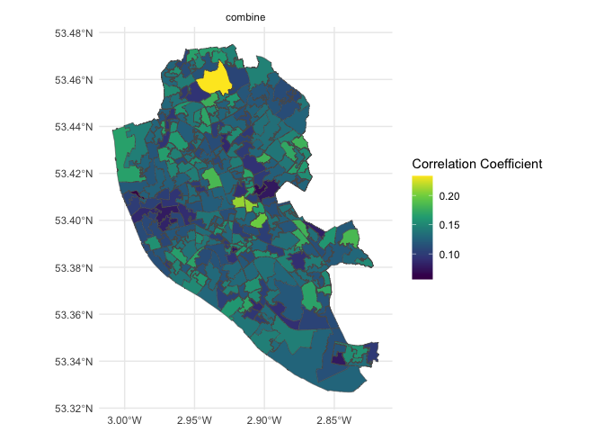
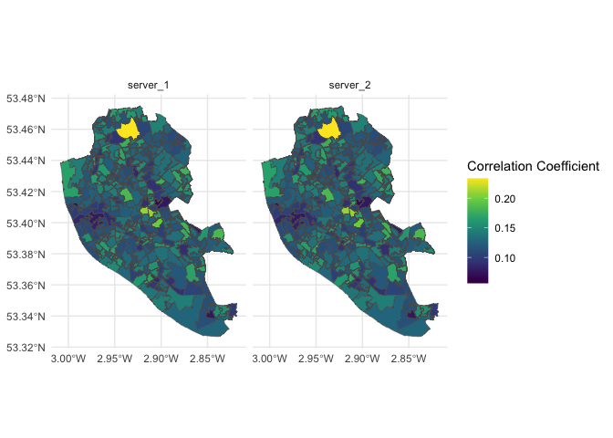

geospatial_correlation
================
2026-07-23

## Function summary

Calcultes the correlation coefficient between two variables (numeric or
logical) on an LSOA level and plots on a map. Plotting donewith library
sf and ggplot2 and colour pallette from grDevices::colorRampPalette.

Current testing done on synthetic health outcome data created by RVD.

# Upload data data and load back with DSLite

Set nfilter.tab

``` r
nfilter.tab  <- 3
```

## Server-side function

## Client-side function

LSOA-level plotting can be done by combining or by splitting across the
servers.

## Output

``` r
ds.groupcor("D$has_asthma", "D$distance_local_greenspace", "D$lsoa11cd", datasources = conns, type = "combine")
```

<!-- -->

``` r
ds.groupcor("D$has_asthma", "D$distance_local_greenspace", "D$lsoa11cd", datasources = conns, type = "split")
```

<!-- -->
